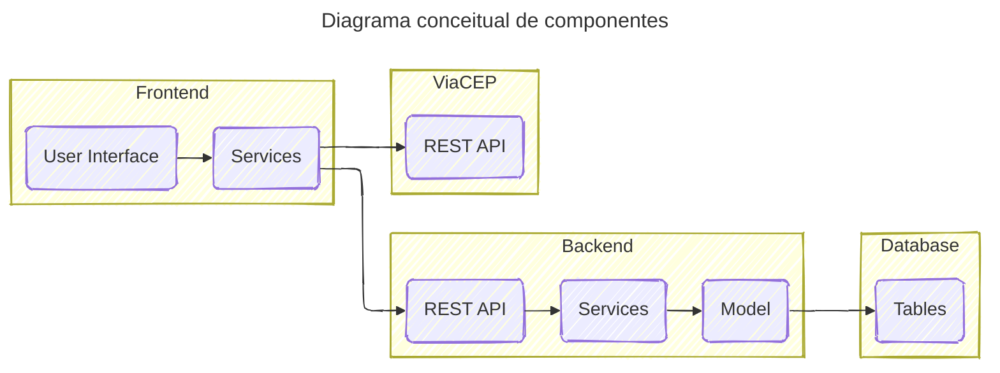

# Visão arquitetural

## Introdução

**Objetivo:** Apresentar a arquitetura do sistema, detalhando os componentes, tecnologias e justificativas das escolhas.

**Contexto:** O projeto é um *code challenge*, parte do processo seletivo para Arquiteto de Sistemas e consiste em um cadastro de Contratos e Clientes ([veja os requisitos](requirements.md))

## Visão Geral da Arquitetura

### Componentes:

Sendo um sistema bastante simples, a escolha recai sobre uma arquitetura tradicional em que a interface de usuário é baseada em ambiente web, rodando no navegador, acessando um conjunto de serviços web que fornecerão todos os dados e toda a inteligência do negócio. Podemos representaressa arquitetura, de maneira conceitual, da seguinte forma:

#### Frontend

O frontend é a parte de uma aplicação com a qual o usuário interage diretamente. É a interface visual que você vê e utiliza quando acessa um site, aplicativo web ou software. Em resumo, o frontend é tudo aquilo que o usuário enxerga e com o qual interage.

- [**Frontend:** arquitetura, tecnologias e justificativa](frontend.md)

#### Backend

O backend é a parte de uma aplicação que fica "por trás dos panos", ou seja, é a lógica que opera em segundo plano, permitindo que o frontend funcione corretamente. Enquanto o frontend é a interface visual com a qual o usuário interage, o backend é responsável por todas as operações que acontecem "nos bastidores".

- [**Backend**: arquitetura, tecnologias e justificativa](backend.md)

#### Banco de dados

Um SGBDR, ou Sistema Gerenciador de Banco de Dados Relacional, é um software que organiza, armazena e gerencia dados em um formato estruturado, permitindo que sejam acessados, atualizados e recuperados de forma eficiente.

Em outras palavras, um SGBDR é como um arquivo de armário super organizado, onde cada gaveta contém informações específicas e você pode encontrar o que precisa rapidamente e de forma segura.

- [**Banco de dados**: arquitetura, tecnologias e justificativa](db.md)

#### Serviço de endereçamento

Um dos requisitos do projeto era a utilização de um serviço web que permitisse obter o endereço a partir de um CEP.

- [**Serviço de endereçamento**: tecnologias e justificativa](cep.md)
