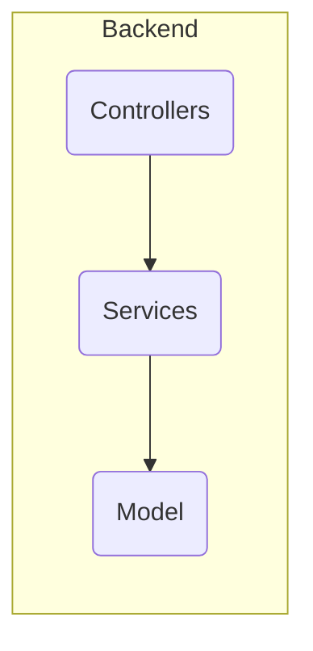

# Backend

[**<-- Voltar**](arquitetura.md)

```mermaid
graph LR
    subgraph Backend
        B1(Controllers)
        B2(Services)
        B3(Model)
        B1 --> B2
        B2 --> B3
    end
```

[**<-- Voltar**](arquitetura.md)
