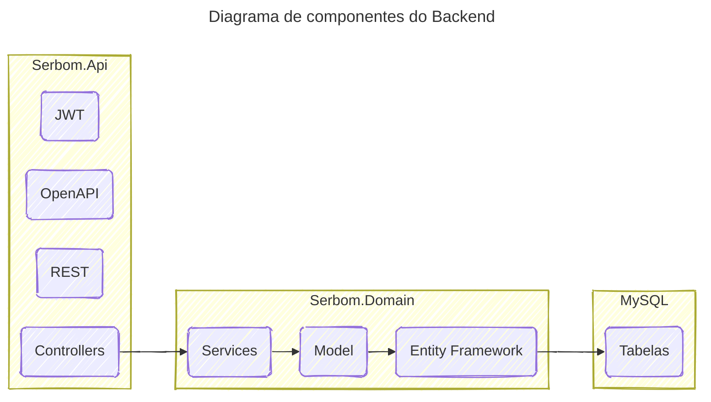

# Backend

  

[**<-- Voltar**](arquitetura.md)

O Backend é composto de diversas camadas, com responsabilidades bem definidas:

1. **Serbom.Api** - recebe a requisição HTTP e retornar uma resposta válida
2. **Serbom.Domain** - implementa todas as regas de negócio
3. **Serbom.Domain.Model** - encapsula os modelos e a chamada ao banco de dados

## Justificativa

A escolha das tecnologias e a arquitetura proposta para o backend demonstram um entendimento sólido dos princípios de design de software, especialmente do Domain-Driven Design (DDD) e da Clean Architecture. Vamos analisar cada componente e sua justificativa, relacionando-os com os padrões mencionados:

### ASP.NET Core Web API e OpenAPI

Esse framework fornece uma base sólida para a construção de APIs RESTful, oferecendo ferramentas e convenções para lidar com requisições HTTP, modelagem de dados e serialização. Sua performance e flexibilidade a tornam uma escolha popular para backends modernos.

O Web API ainda implementa o padrão OpenAPI (anteriormente conhecido como Swagger), que é fundamental para documentar APIs RESTful de forma clara e concisa. Ele permite gerar automaticamente interfaces de usuário interativas para testar a API, facilitando o desenvolvimento e a integração com outros sistemas. Além disso, o OpenAPI facilita a geração de código-cliente para diferentes linguagens de programação.

#### Alinhamento com DDD e Clean Architecture:

- **Contrato explícito:** O OpenAPI define um contrato explícito entre o backend e os clientes, garantindo que ambos compreendam as expectativas em relação aos dados e operações disponíveis. Isso alinha-se com o princípio de um limite claro entre o núcleo do domínio e o mundo externo na Clean Architecture.
- **Facilidade de evolução:** A documentação gerada pelo OpenAPI facilita a evolução da API, pois qualquer alteração no contrato deve ser refletida na documentação. Isso é crucial para garantir a compatibilidade com os clientes existentes.

### JSON Web Tokens

JSON Web Tokens são uma forma segura e eficiente de autenticar usuários em APIs RESTful. Eles são autocontidos e podem ser facilmente verificados pelo servidor. O JWT oferece um mecanismo seguro para proteger os recursos da API, garantindo que apenas usuários autorizados possam acessar os dados.

#### Alinhamento com DDD e Clean Architecture:

- **Mecanismo de segurança:** O JWT se encaixa na camada de infraestrutura da Clean Architecture, fornecendo um mecanismo de segurança sem se preocupar com os detalhes do domínio.
- **Independência do domínio:** A lógica de autenticação e autorização, baseada em JWT, é isolada do núcleo do domínio, permitindo que o domínio se concentre nas regras de negócio.

### Camadas

#### 1. Serbom.Api

Essa camada é responsável por expor a API RESTful, lidar com as requisições HTTP e retornar as respostas. Ela se alinha com a camada de aplicação na Clean Architecture, orquestrando as operações do domínio.

#### 2. Serbom.Domain

Essa camada encapsula a lógica de negócio da aplicação, definindo as entidades, os agregados e os serviços. Ela representa o núcleo do domínio e se alinha com a camada de domínio na Clean Architecture.

#### 3. Serbom.Domain.Model

Essa camada contém as classes que representam os dados do banco de dados, mapeando as entidades do domínio para as tabelas do banco. Ela se encaixa na camada de infraestrutura, fornecendo um mecanismo para persistir os dados.

#### Alinhamento com DDD e Clean Architecture:

- **Separação de responsabilidades:** A divisão em camadas claras permite uma melhor organização do código e facilita a manutenção e o teste.
- **Foco no domínio:** A camada de domínio se concentra nas regras de negócio, enquanto as outras camadas se preocupam com detalhes técnicos como a persistência de dados e a comunicação com o mundo externo.
- **Entity Framework:** O Entity Framework, ao mapear as entidades do domínio para o banco de dados, facilita a persistência dos dados e se encaixa na camada de infraestrutura.

## Em resumo
A arquitetura proposta demonstra um bom entendimento dos princípios de DDD e Clean Architecture. As tecnologias escolhidas e a forma como elas foram organizadas em camadas contribuem para:

1. **Manutenibilidade:** A separação de responsabilidades facilita a compreensão e a manutenção do código.
2. **Testebilidade:** Cada camada pode ser testada de forma isolada, facilitando a identificação e correção de bugs.
3. **Reusabilidade:** A camada de domínio pode ser reutilizada em outros projetos, desde que as regras de negócio sejam semelhantes.
4. **Escalabilidade:** A arquitetura pode ser facilmente expandida para atender a novas funcionalidades e requisitos.

Em suma, a escolha dessas tecnologias e a organização em camadas proporcionam uma base sólida para o desenvolvimento de um sistema escalável, manutenível e alinhado com as melhores práticas de desenvolvimento de software.

[**<-- Voltar**](arquitetura.md)
