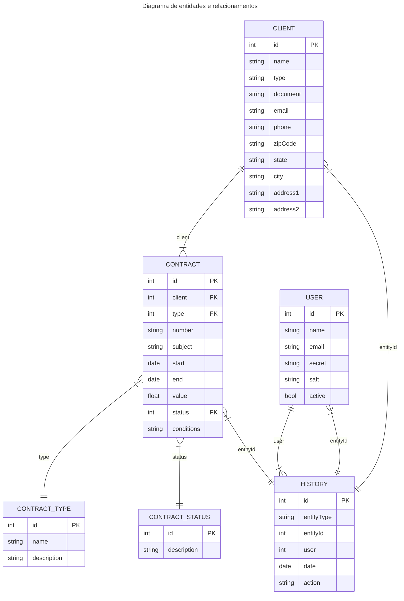

# Banco de dados

[**<-- Voltar**](arquitetura.md)

## Tecnologia

O MySQL é um dos sistemas gerenciadores de bancos de dados relacionais (SGBDR) mais populares e utilizados no mundo. Sua escolha para um desafio de desenvolvimento, especialmente quando não há restrições específicas, é bastante justificável por diversos motivos:

### 1. Maturidade e Estabilidade:

- **Amplamente utilizado:** O MySQL é utilizado em uma vasta gama de aplicações, desde pequenos sites até grandes sistemas corporativos. Essa ampla adoção garante uma comunidade ativa, extensa documentação e diversas ferramentas disponíveis.
- **Histórico de estabilidade:** Ao longo de seus anos de existência, o MySQL demonstrou ser um SGBDR robusto e confiável, capaz de lidar com grandes volumes de dados e altas cargas de trabalho.

### 3. Facilidade de Uso e Aprendizado:

- **Sintaxe SQL padrão:** O MySQL utiliza a linguagem SQL padrão, que é amplamente compreendida e utilizada por desenvolvedores.
- **Abundante documentação e tutoriais:** A comunidade MySQL oferece uma vasta quantidade de recursos para aprendizado e solução de problemas.
- **Ferramentas amigáveis:** Existem diversas ferramentas gráficas e de linha de comando que facilitam a administração e o desenvolvimento de bancos de dados MySQL, incluindo o Visual Studio Code.

### 4. Performance e Escalabilidade:

- **Otimizado para diversas cargas de trabalho:** O MySQL oferece diversas opções de configuração e otimização para diferentes tipos de aplicações, desde sistemas de alta disponibilidade até aplicações com muitas consultas de leitura.
- **Capacidade de escalar:** O MySQL pode ser escalado tanto verticalmente (adicionando mais recursos ao servidor) quanto horizontalmente (utilizando replicação ou sharding).

### 5. Custo-Benefício:

- **Versão Community gratuita:** O MySQL oferece uma versão Community gratuita com recursos suficientes para a maioria das aplicações.
- **Baixo custo de manutenção:** A simplicidade de administração e a ampla comunidade contribuem para um baixo custo de manutenção.

### 6. Suporte a Transações e Integridade de Dados:

- **Transações ACID:** O MySQL suporta transações ACID (Atomicidade, Consistência, Isolamento e Durabilidade), garantindo a integridade dos dados.   
- **Relações e índices:** O modelo relacional do MySQL permite criar relacionamentos complexos entre as tabelas e utilizar índices para otimizar as consultas.

Em resumo, o MySQL é uma excelente escolha para um desafio de desenvolvimento por:

* Ser amplamente utilizado e conhecido
* Oferecer um bom equilíbrio entre performance, facilidade de uso e custo
* Ser adequado para uma ampla variedade de aplicações
* Ter uma comunidade ativa e extensa documentação

## Entidades

Devido à baixa complexidade do projeto, ele é composto basicamente pelo **Contrato**, **Cliente**, **Usuário** e **Histórico**.

### 1. Contrato
É a razão de ser do sistema. Concentra todos os dados do contrato em si e é composto por outras duas entidades, o tipo e o status.

### 2. Cliente
É o cliente a quem o contrato pertence. Um cliente pode ter muitos contratos.

### 3. Usuário
É a pessoa que realiza ações no sistema.

### 4. Histórico
Registra todas as atividades do sistema, ou seja, todas as ações de inclusão, alteração e apagamento de Clientes, Contratos e Usuários.

### Observação
Outras entidades foram criadas no banco de dados como proposta de melhoria do sistema, mas não foram implementadas e, por conta disso, não fazem parte do diagrama. São elas:

- **Adendo:** para o registro de adendos contratuais
- **Anexo:** para a inclusão de anexos aos contratos

[**<-- Voltar**](arquitetura.md)
